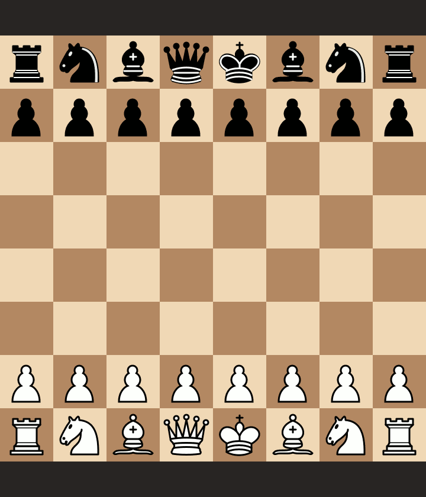

# L'écossaise facile avec les blancs

Etude créée à partir des vidéos YouTube de Blitzstream concernant les ouvertures faciles avec les blancs. Focus sur les variantes possibles de l'ouverture écossaise avec Kévin Bordi et Fabien Libiszewski.

- Vidéo 1 : https://www.youtube.com/watch?v=QRSg2GNkcRA
- Vidéo 2 : https://www.youtube.com/watch?v=cvXAEdR41XU
- Vidéo 3 : https://www.youtube.com/watch?v=yYHPT29F6zc
- Vidéo 4 : https://www.youtube.com/watch?v=vijqNevs19A
- Vidéo 5 : https://www.youtube.com/watch?v=TDP2whVWgZs

Etude Lichess disponible ici : https://lichess.org/study/gwcHFDpu.

## Vidéo 1

### Scénario 1

### Scénario 2

### Scénario 3

### Scénario 4

### Scénario 5

### Scénario 6

### Scénario 7

### Scénario 8

### Scénario 9

### Scénario 10

## Vidéo 2

### Scénario 11

### Scénario 12

### Scénario 13

### Scénario 14

### Scénario 15

## Vidéo 3

### Scénario 16

### Scénario 17

### Scénario 18

### Scénario 19

### Scénario 20

### Scénario 21

### Scénario 22

### Scénario 23

### Scénario 24

## Vidéo 4

### Scénario 25

### Scénario 26

### Scénario 27

### Scénario 28

## Vidéo 5

### Scénario 29

### Scénario 30

### Scénario 31

### Scénario 32

