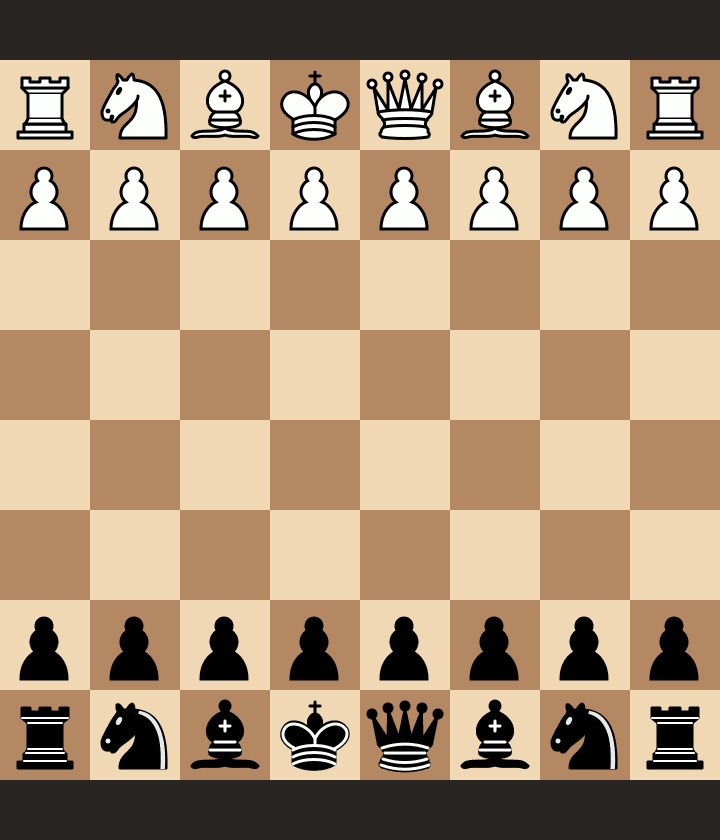

# La française facile avec les noirs

Etude créée à partir d'une série de vidéos YouTube de Blitzstream. Focus sur la française avec les noirs avec Kévin Bordi et Fabien Libiszewski (répertoire jusqu'à 1800~2000 ELO).

- Vidéo 0 : https://youtu.be/W21cTjZF8rs (intro)
- Vidéo 1 : https://youtu.be/v_EFNZAE6lA (variante d'avance)
- Vidéo 2 : https://youtu.be/01rZkIPVLmM (variante d'échange)
- Vidéo 3 : A venir
- Vidéo 4 : A venir
- Vidéo 5 : A venir

Etude Lichess disponible ici : https://lichess.org/study/JgfRhwcH.

## Vidéo 1 (variante d'avance)

### Scénario 1

### Scénario 2

Piège dans lequel ne pas tomber après le roque des blancs (attention au sacrifice calabrais).

### Scénario 3

### Scénario 4

### Scénario 5

### Scénario 6

## Vidéo 2 (variante d'échange)

### Scénario 7

### Scénario 8

### Scénario 9

### Scénario 10

### Scénario 11

### Scénario 12

### Scénario 13

