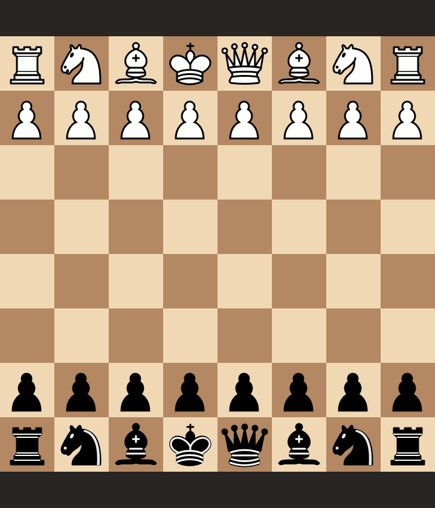

# Les pièges du gambit Stafford avec les noirs

Etude créée à partir de la vidéo YouTube de Eric Rosen sur les pièges du gambit Stafford : https://youtu.be/nH_fiqlLp2U. Pour aller plus loin, vidéo plus complète sur le gambit Stafford de manière générale : https://youtu.be/XkB4IVNaZWw.

Etude Lichess disponible ici : https://lichess.org/study/Onbup4bN.

## Piège 1 (sur d3)

## Piège 2 (sur d3)

## Piège 3 (sur d3)

## Piège 4 (sur d3 et Cc3)

## Piège 5 (sur d3 et h3)

## Piège 6 (sur e5 et d3)

## Piège 7 (sur e5 et d3)

## Piège 8 (sur e5 et d4)

## Piège 9 (sur Cc3 et d3)

## Piège 10 (sur Cc3 et Fc4)

## Piège 11 (sur Cc3, Fc4 et Df3)

## Piège 12 (sur Cc3 et Fe2)

## Piège 13 (sur Cc3 et Fe2)

## Piège 14 (sur Cc3 et Fe2)

## Piège 15 (sur Cc3 et Fe2)

